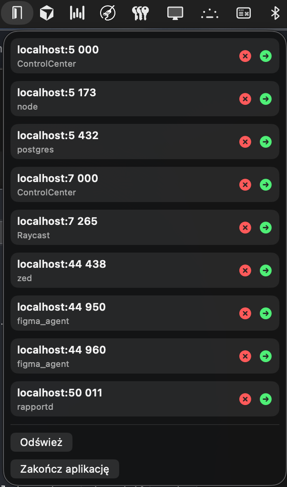

# LPortsCenter

`LPortsCenter` is a compact macOS menu bar utility built with SwiftUI for local development workflows.

The application provides live visibility into currently listening local TCP ports and offers direct actions from the menu:
- open `http://localhost:<port>` in the default browser,
- terminate the owning process (`PID`) directly from the menu,
- refresh port state on demand (with periodic auto-refresh).

The project is intentionally lightweight, transparent in behavior, and optimized for day-to-day developer productivity.

## Preview



## Core capabilities

- Real-time discovery of listening ports via `lsof` (`TCP`, `LISTEN` state)
- Duplicate suppression for IPv4/IPv6 entries (`pid + port`)
- One-line compact rows with:
  - left side: `localhost:<port>`
  - subtitle: owning application/process name
  - right side: action icons (`close` and `open`)
- Menu bar only runtime mode (no Dock icon)

## Technology stack

- Swift 6.2
- SwiftUI (`MenuBarExtra`)
- AppKit interoperability (`NSWorkspace`, activation policy)
- Swift Package Manager

## Run locally

```bash
swift build
swift run
```

## Build target

- Platform: `macOS 13+`

## Notes on process control

`Close` sends `SIGTERM` to the process owning the selected port.  
Some system processes may reject termination due to macOS permissions or protection policies.
